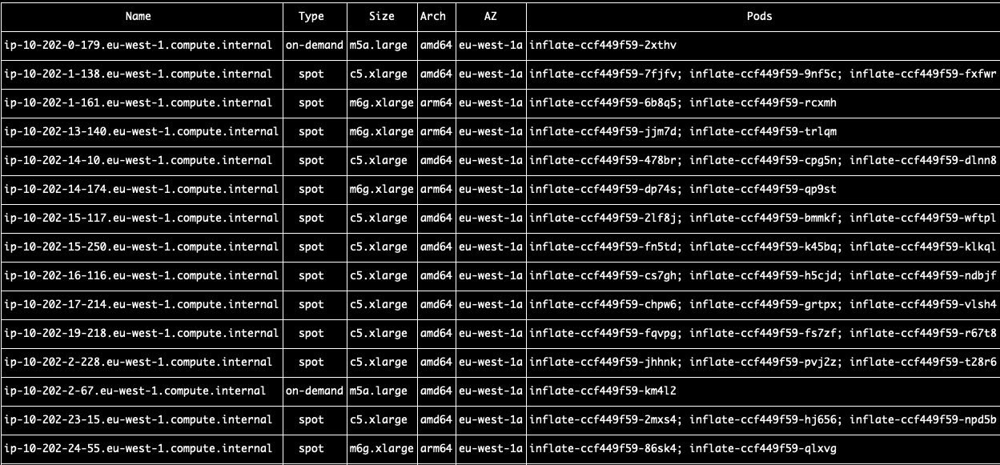

# kubenodes

Get a view of pods according to the spread on the nodes.

This app was made to view pods according to well known labels, and not with AWS SDK to determine if an instance is a spot or on-demand, instead it relays on [karpenter.sh](https://karpenter.sh) labels (I might add AWS SDK for mode node information).

Well-known labels I am using:

- karpenter.sh/capacity-type
- node.kubernetes.io/instance-type
- kubernetes.io/arch
- topology.kubernetes.io/zone

>Please submit PR for more labels, or to add AWS SDK for more instance information

In order to list pod status according to its pods, use the label `app`

```bash
kubenodes -l my-app -n my-namespace
```

```bash
kubenodes -h
Top down view from nodes to pods in a namespace

Usage:
  kubenodes [flags]

Flags:
      --compact             how to see pod listing in the node view
  -h, --help                help for kubenodes
  -k, --kubeconfig string   kubeconfig path
  -l, --label strings       app pod label, looks for app=[deployment_name], -l a,b
  -n, --namespace string    kubernetes namespace (default "default")
  -r, --refresh int         application refresh interval (default 5)
  -v, --version             version for kubenodes
```

and make sure to label the app with `app: my-app` in kubernetes manifest

you have the option to use `--compact` flag to see a compact list of pods in a single node row.


